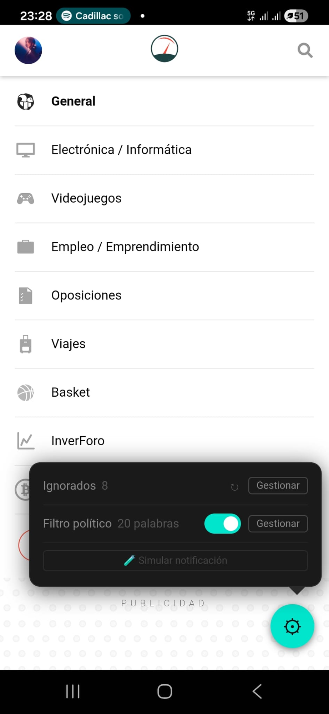
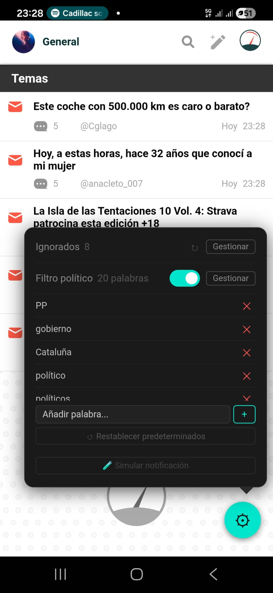

# Forocoches+

App Android no oficial para Forocoches que mejora la experiencia del foro con filtros, notificaciones y otras utilidades.

## Capturas

<p float="left">
  
  
</p>

## Funcionalidades

### Filtro de usuarios ignorados
- Oculta hilos del listado creados por usuarios ignorados
- Oculta posts de usuarios ignorados dentro de los hilos
- Oculta posts que citan a usuarios ignorados
- Se sincroniza con la lista de ignorados de tu cuenta de Forocoches

### Filtro político
- Oculta hilos cuyos títulos contienen palabras clave configurables
- Activado por defecto con términos de política española
- Toggle on/off desde el panel de ajustes
- Lista de palabras editable: añadir, eliminar, restaurar defaults

### Notificaciones push
- Polling en background cada ~15 minutos
- Notificación cuando recibes mensajes privados nuevos
- Badge numérico en el icono de la app
- Funciona con la app cerrada

### Pull-to-refresh
- Desliza hacia abajo para recargar la página actual

### Panel de ajustes
- Botón flotante (⚙) en esquina inferior derecha
- Gestión de usuarios ignorados con opción de sincronizar
- Gestión del filtro político

### Bloqueador de anuncios
- Bloquea dominios publicitarios conocidos
- CSS adicional para ocultar elementos de anuncios

## Arquitectura

- **WebView** envuelve la web móvil de Forocoches (`forocoches.com/foro/`)
- **content.js** — script inyectado en cada página para filtrado de contenido
- **settings-panel.js** — script inyectado que crea el panel de ajustes flotante
- **SettingsBridge** — interfaz `@JavascriptInterface` entre JS y Kotlin
- **IgnoreListRepository** — persistencia de lista de ignorados en SharedPreferences
- **KeywordRepository** — persistencia de palabras clave en SharedPreferences
- **NotificationRepository** — estado de notificaciones en SharedPreferences
- **NotificationWorker** — WorkManager para polling en background
- **NotificationFetcher** — parseo HTML de la página de notificaciones del foro

## Requisitos

- Android 8.0+ (API 26)
- Cuenta en Forocoches

## Build

```bash
./gradlew assembleDebug
```
